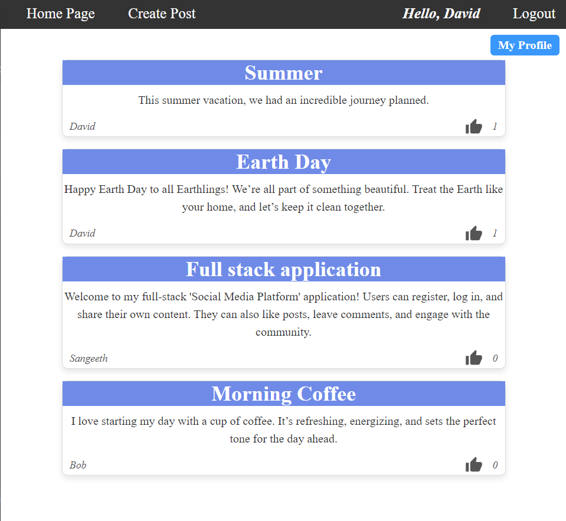

<a id="readme-top"></a>

<!-- PROJECT LOGO -->
<br />
<div align="center">
  <a href="https://github.com/Sangeethsk01/SocialMediaPlatform>
    
  </a>

<h3 align="center">Social Media Platform</h3>

  <p align="center">
    A basic example of a working full-stack project with CRUD operations.
    <br />
    <a href="[https://github.com/Sangeethsk01/SocialMediaPlatform](https://github.com/Sangeethsk01/SocialMediaPlatform)"><strong>Explore the docs »</strong></a>
    <br />
    <br />
    <a href="https://github.com/Sangeethsk01/SocialMediaPlatform">View Demo</a>
    <!-- Report Bug -->
    <!-- Request Feature -->
  </p>
</div>


<!-- TABLE OF CONTENTS -->
<details>
  <summary>Table of Contents</summary>
  <ol>
    <li>
      <a href="#about-the-project">About The Project</a>
      <ul>
        <li><a href="#built-with">Built With</a></li>
      </ul>
    </li>
    <li>
      <a href="#getting-started">Getting Started</a>
      <ul>
        <li><a href="#prerequisites">Prerequisites</a></li>
        <li><a href="#installation">Installation</a></li>
      </ul>
    </li>
    <li><a href="#usage">Usage</a></li>
    <li><a href="#roadmap">Roadmap</a></li>
    <li><a href="#contributing">Contributing</a></li>
    <li><a href="#contact">Contact</a></li>
    <li><a href="#acknowledgments">Acknowledgments</a></li>
  </ol>
</details>


<!-- ABOUT THE PROJECT -->
## About The Project



This full-stack web application serves as a basic social media platform, allowing users to create accounts, log in, post content, and interact with others by liking or commenting on posts. The application provides a seamless user experience, offering essential features that users expect in a social networking environment.

The user data is stored in MySQL, with Sequelize employed as an ORM to facilitate interactions with the database. For secure user authentication, JSON Web Tokens (JWT) are implemented, ensuring that only authorized users can access certain functionalities of the platform.

On the front end, the application is built using React and its associated libraries, providing a dynamic and responsive interface. The backend is powered by Express.js and Sequelize, ensuring smooth communication between the client and the server.

The application uses the Axios library to handle API requests, enabling efficient and reliable communication between the front and back end.<p align="right">(<a href="#readme-top">back to top</a>)</p>


### Built With

* [![React][React.js]][React-url]
* [![Express][Express.js]][Express-url]
* [![MySQL][MySQL]][MySQL-url]
* [![Sequelize][Sequelize]][Sequelize-url]
* [![JavaScript][JavaScript]][JavaScript-url]
  

<p align="right">(<a href="#readme-top">back to top</a>)</p>


<!-- GETTING STARTED -->
## Getting Started

To get a local copy up and running follow these simple example steps.

### Prerequisites

This is an example of how to list things you need to use the software and how to install them.
* npm
  ```sh
  npm install npm@latest -g
  ```

### Installation

<!-- Comming soon -->

<p align="right">(<a href="#readme-top">back to top</a>)</p>


<!-- USAGE EXAMPLES -->
## Usage

<p align="right">(<a href="#readme-top">back to top</a>)</p>


<!-- ROADMAP -->
## Roadmap

- [ ] Create an account with a username and password
- [ ] Login 
- [ ] Create a post using create post link on the nav bar
    - [ ] Enter post text
- [ ] Like a post on home page
- [ ] Click on a post to see its comments
    - [ ] Add a comment to the post
- [ ] Click on my profile to access your posts
    - [ ] Use change password button to update password


<p align="right">(<a href="#readme-top">back to top</a>)</p>


<!-- CONTRIBUTING -->
## Contributing

If you have a suggestion that would make this better, please fork the repo and create a pull request. You can also simply open an issue with the tag "enhancement".

1. Fork the Project
2. Create your Feature Branch (`git checkout -b feature/AmazingFeature`)
3. Commit your Changes (`git commit -m 'Add some AmazingFeature'`)
4. Push to the Branch (`git push origin feature/AmazingFeature`)
5. Open a Pull Request

<p align="right">(<a href="#readme-top">back to top</a>)</p>

### Top contributors:


<!-- CONTACT -->
## Contact

Sangeeth Kumar Kotagiri - [@twitter_handle](https://x.com/sangeethsk01) - sangeethsk01@gmail.com

Project Link: [https://github.com/Sangeethsk01/SocialMediaPlatform](https://github.com/Sangeethsk01/SocialMediaPlatform)

<p align="right">(<a href="#readme-top">back to top</a>)</p>


<!-- ACKNOWLEDGMENTS -->
## Acknowledgments
* [PedroTech](https://github.com/machadop1407/FullStack-Course/tree/Episode14)

<p align="right">(<a href="#readme-top">back to top</a>)</p>


<!-- MARKDOWN LINKS & IMAGES -->
<!-- https://www.markdownguide.org/basic-syntax/#reference-style-links -->
[contributors-shield]: https://img.shields.io/github/contributors/github_username/repo_name.svg?style=for-the-badge
[contributors-url]: https://github.com/github_username/repo_name/graphs/contributors
[forks-shield]: https://img.shields.io/github/forks/github_username/repo_name.svg?style=for-the-badge
[forks-url]: https://github.com/github_username/repo_name/network/members
[linkedin-shield]: https://img.shields.io/badge/-LinkedIn-black.svg?style=for-the-badge&logo=linkedin&colorB=555
[linkedin-url]: https://linkedin.com/in/linkedin_username
[React.js]: https://img.shields.io/badge/React-20232A?style=for-the-badge&logo=react&logoColor=61DAFB
[React-url]: https://reactjs.org/
[Express.js]: https://img.shields.io/badge/Express.js-000000?style=for-the-badge&logo=express&logoColor=white
[Express-url]: https://expressjs.com/
[MySQL]: https://img.shields.io/badge/MySQL-4479A1?style=for-the-badge&logo=mysql&logoColor=white
[MySQL-url]: https://www.mysql.com/
[Sequelize]: https://img.shields.io/badge/Sequelize-52B0E7?style=for-the-badge&logo=sequelize&logoColor=white
[Sequelize-url]: https://sequelize.org/
[JavaScript]: https://img.shields.io/badge/JavaScript-F7DF1E?style=for-the-badge&logo=javascript&logoColor=black
[JavaScript-url]: https://developer.mozilla.org/en-US/docs/Web/JavaScript

